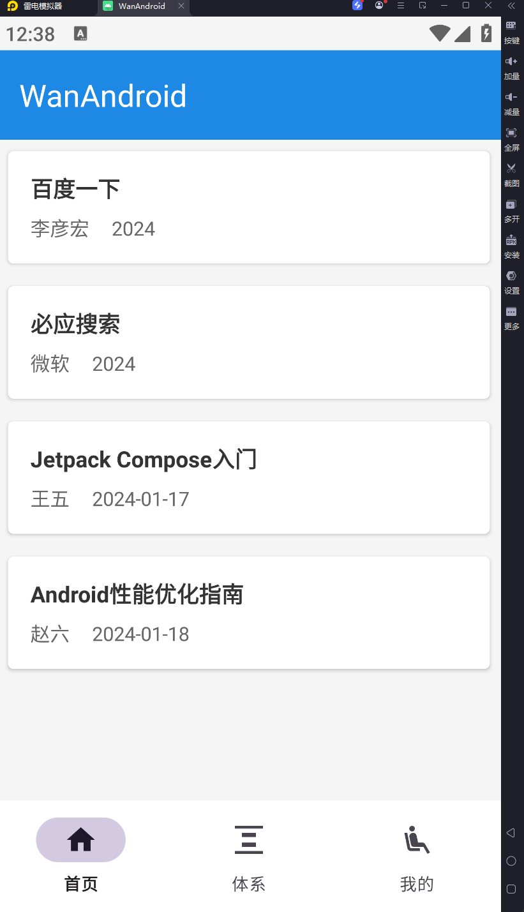
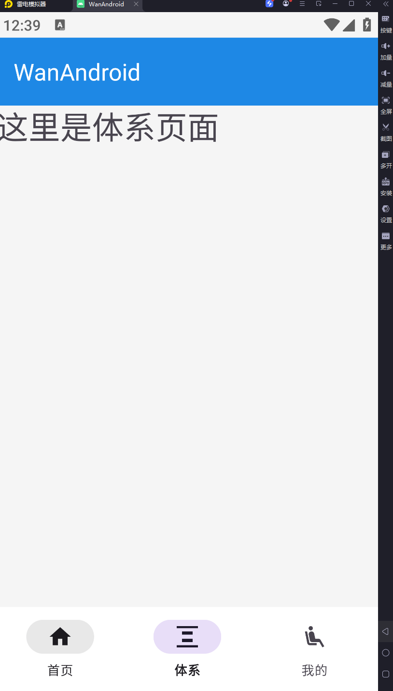
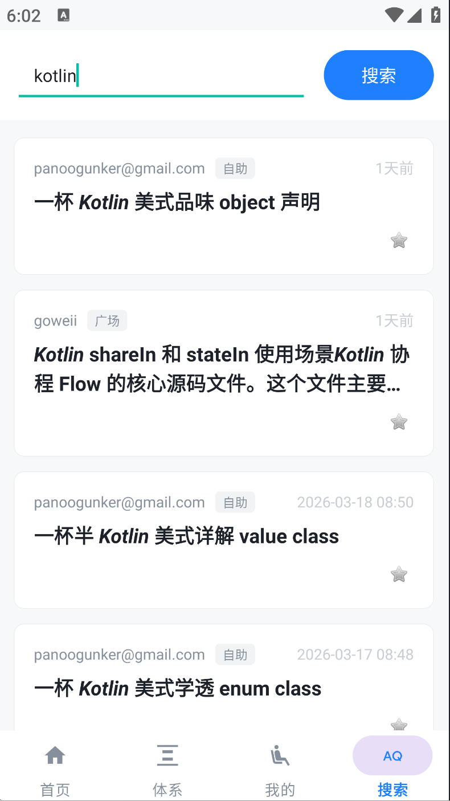
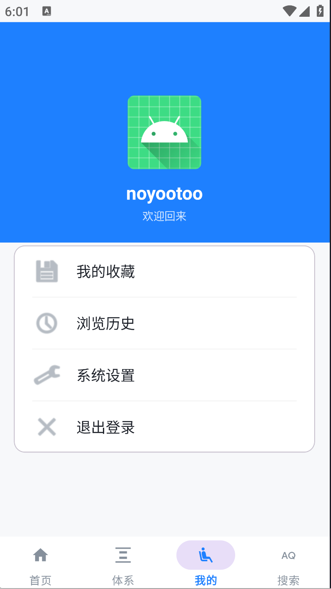

# WanAndroid

一个基于现代 Android 开发架构（Modern Android Development, MAD）构建的 WanAndroid 客户端。项目采用了单向数据流（MVI/MVVM）架构，结合了主流的开源库，适合作为学习现代 Android 开发的参考范例。

## 核心架构与技术栈

- **架构模式**：MVVM 架构模式，配合 Kotlin Flow 实现单一数据源（Single Source of Truth, SSOT）与单向数据流。
- **语言**：100% Kotlin，全面使用协程（Coroutines）处理异步任务。
- **网络请求**：Retrofit + OkHttp。
- **持久化存储**：
  - **Room**：作为本地唯一可信数据源，实现离线缓存与无缝数据刷新。
  - **DataStore**：替代传统的 SharedPreferences，响应式地管理 Cookie 与用户状态。
- **UI 组件**：
  - Material Design 3 沉浸式设计规范。
  - ViewBinding 用于视图绑定。
  - Coil 用于图片加载。

## 功能特性

- **完整的用户闭环**：登录、注册、状态持久化、安全退出。
- **全局拦截器**：基于 OkHttp Interceptor 实现 Cookie 的自动提取、本地保存与无感知注入。
- **缓存策略**：首页列表数据优先从 Room 数据库读取，后台静默拉取网络数据并自动更新 UI。
- **文章浏览与交互**：
  - 支持下拉刷新与上拉加载更多。
  - 文章已读状态记录并持久化。
  - 乐观更新策略实现文章的收藏与取消收藏。
- **多状态视图管理**：优雅处理 Loading、Success、Error、Empty 等页面状态。

## 项目结构

```
com.example.wanandroid
├── adapter       # RecyclerView 适配器 (基于 ListAdapter 与 DiffUtil)
├── base          # 基础组件封装 (如 BaseFragment)
├── db            # Room 数据库配置 (Entity, Dao, Database)
├── model         # 数据实体类与 UI 状态密封类 (UiState)
├── network       # 网络请求配置及 OkHttp 拦截器
├── repository    # 数据仓库层，负责网络与本地数据的调度
├── utils         # 工具类 (DataStoreManager 等)
├── viewmodel     # 视图模型，处理业务逻辑并暴露 StateFlow/SharedFlow
└── ...           # Activity/Fragment 等 UI 层组件
```

## 运行与编译

- Android Studio Koala 或更高版本。
- Gradle 8.0+。
- Kotlin 1.9.0+。

## 项目截图

### 首页


### 体系页


### 搜索页


### 我的页面


### 详情页

